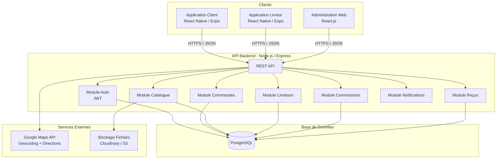
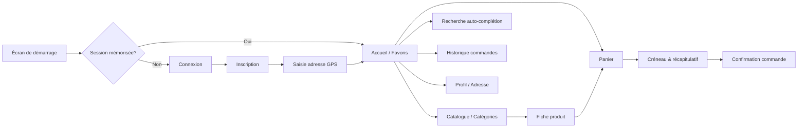
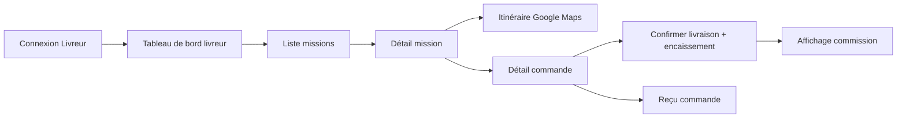
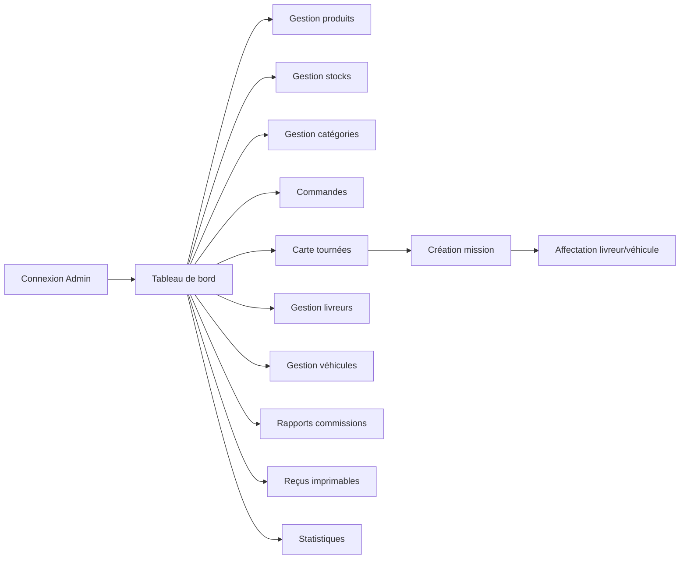
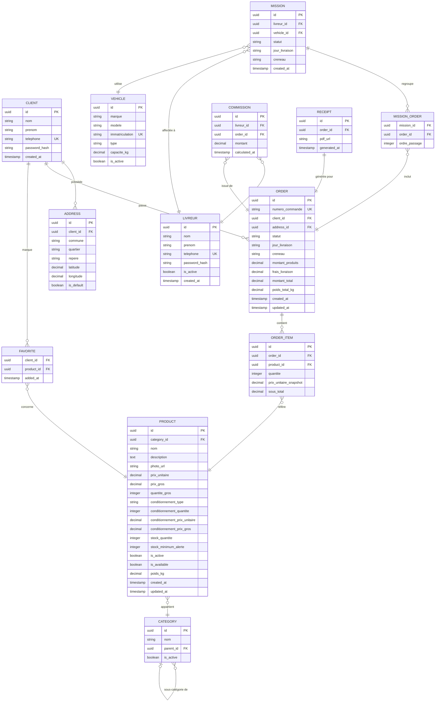
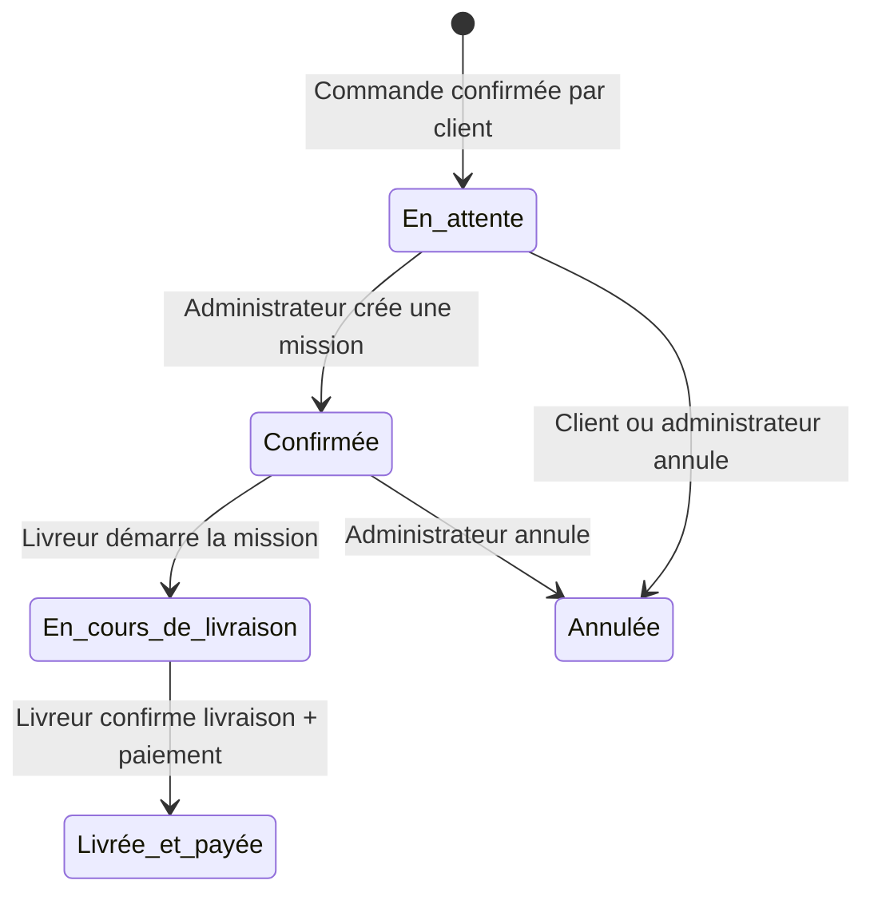

# Document de Conception Technique — AlloPanier

## Overview

AlloPanier est une plateforme de commerce électronique et de livraison à domicile conçue pour le marché béninois (Abomey-Calavi). Elle repose sur trois espaces distincts :

- **Application Client** (mobile iOS/Android) : permet aux particuliers, familles, restaurants, hôtels et entreprises de parcourir un catalogue, de constituer un panier, de planifier leur livraison et de consulter leur historique de commandes.
- **Application Livreur** (mobile iOS/Android) : permet aux livreurs de consulter leurs missions, de suivre l'itinéraire Google Maps et de confirmer les livraisons avec encaissement.
- **Administration Web** : permet à l'administrateur de gérer produits, stocks, catégories, livreurs, véhicules, tournées et de consulter le tableau de bord.

Le paiement est exclusivement en espèces à la livraison (Cash on Delivery) pour la version 1. L'intégration Google Maps est centrale pour la géolocalisation des adresses et l'optimisation des itinéraires. Les polices d'interface sont **Poppins** et **Century Gothic**.

---

## Architecture

### Vue générale



### Décisions d'architecture

| Décision | Choix | Justification |
|---|---|---|
| Framework mobile | React Native / Expo | Code partagé iOS/Android, large écosystème, facilité de déploiement |
| Framework web | React.js | Composants riches, performances pour le tableau de bord |
| Backend | Node.js / Express | Léger, adapté aux API REST, bon écosystème |
| Base de données | PostgreSQL | Transactions ACID pour la gestion des stocks, relations complexes |
| Authentification | JWT (JSON Web Tokens) | Stateless, adapté aux API mobiles |
| Cartographie | Google Maps SDK | Intégration native iOS/Android, API Directions pour itinéraires |
| Stockage médias | Cloudinary | Upload et transformation d'images produits |
| Communication temps réel | WebSockets (Socket.io) | Alertes stock, mise à jour statut commandes |

---

## Components and Interfaces

### Application Client (Mobile)



**Interfaces API consommées (Application Client) :**

| Endpoint | Méthode | Description |
|---|---|---|
| `/auth/register` | POST | Inscription client |
| `/auth/login` | POST | Connexion client |
| `/addresses` | POST/PUT | Créer/modifier adresse GPS |
| `/catalog/categories` | GET | Liste des catégories |
| `/catalog/products` | GET | Produits (filtre catégorie) |
| `/catalog/products/:id` | GET | Fiche produit |
| `/catalog/search` | GET | Recherche auto-complétion |
| `/orders` | POST | Créer une commande |
| `/orders` | GET | Historique commandes |
| `/orders/:id/reorder` | POST | Recharger une commande |
| `/favorites` | GET/POST/DELETE | Gestion favoris |
| `/delivery/slots` | GET | Créneaux disponibles |
| `/delivery/fees` | POST | Calcul frais de livraison |

---

### Application Livreur (Mobile)



**Interfaces API consommées (Application Livreur) :**

| Endpoint | Méthode | Description |
|---|---|---|
| `/auth/delivery/login` | POST | Connexion livreur |
| `/missions` | GET | Missions affectées au livreur |
| `/missions/:id` | GET | Détail mission + commandes |
| `/missions/:id/route` | GET | Itinéraire Google Maps |
| `/orders/:id/deliver` | POST | Confirmer livraison + paiement |
| `/orders/:id/receipt` | GET | Reçu de la commande |
| `/commissions` | GET | Historique commissions livreur |

---

### Administration Web



**Interfaces API consommées (Administration Web) :**

| Endpoint | Méthode | Description |
|---|---|---|
| `/admin/products` | GET/POST/PUT/DELETE | CRUD produits |
| `/admin/categories` | GET/POST/PUT/DELETE | CRUD catégories |
| `/admin/stocks/:productId` | PUT | Mise à jour stock |
| `/admin/orders` | GET | Liste commandes |
| `/admin/orders/map` | GET | Commandes géolocalisées |
| `/admin/missions` | POST | Créer mission |
| `/admin/missions/:id/assign` | PUT | Affecter livreur + véhicule |
| `/admin/drivers` | GET/POST/PUT/DELETE | CRUD livreurs |
| `/admin/vehicles` | GET/POST/PUT/DELETE | CRUD véhicules |
| `/admin/commissions` | GET | Rapport commissions |
| `/admin/orders/:id/receipt` | GET | Reçu imprimable |
| `/admin/stats` | GET | Statistiques filtrées |

---

## Data Models

### Diagramme Entité-Relation



---

### Détail des modèles clés

#### Statuts d'une Commande (machine à états)



#### Barème de livraison (zone Abomey-Calavi)

| Poids total | Frais de livraison |
|---|---|
| ≤ 100 kg | 1 000 FCFA |
| 100 – 250 kg | 1 500 FCFA |
| 250 – 350 kg | 2 000 FCFA |
| 350 – 450 kg | 2 500 FCFA |
| 450 – 550 kg | 3 000 FCFA |
| 550 – 650 kg | 3 500 FCFA |
| > 650 kg | 3 500 FCFA + 500 FCFA × ⌊(poids − 650) / 100⌋ |

#### Créneaux de livraison

| Jour | Créneau Matin | Créneau Après-midi |
|---|---|---|
| Mardi | 08h00 – 12h00 | 14h00 – 18h00 |
| Jeudi | 08h00 – 12h00 | 14h00 – 18h00 |
| Samedi | 08h00 – 12h00 | 14h00 – 18h00 |
| Dimanche | 08h00 – 12h00 | 14h00 – 18h00 |

---


## Correctness Properties

*Une propriété est une caractéristique ou un comportement qui doit être vrai pour toutes les exécutions valides du système — c'est essentiellement un énoncé formel de ce que le logiciel doit faire. Les propriétés servent de pont entre les spécifications lisibles par l'humain et les garanties de correction vérifiables automatiquement.*

---

### Property 1: Validation formulaire — champs obligatoires

*Pour tout* ensemble de valeurs de formulaire d'inscription où au moins un champ obligatoire (Nom, Prénom, Téléphone, Mot de passe, Confirmation) est absent ou vide, la soumission du formulaire doit être rejetée et aucun compte ne doit être créé.

**Valide : Exigences 1.2**

---

### Property 2: Validation formulaire — correspondance des mots de passe

*Pour toute* paire (mot_de_passe, confirmation) où les deux valeurs sont différentes, la validation du formulaire d'inscription doit échouer et afficher un message d'erreur.

**Valide : Exigences 1.4**

---

### Property 3: Round-trip adresse de livraison

*Pour toute* adresse valide (Commune, Quartier, Repère facultatif, Latitude, Longitude), l'enregistrement puis la relecture de l'adresse via l'API doit produire un objet dont les champs sont identiques à ceux initialement soumis.

**Valide : Exigences 2.5**

---

### Property 4: Persistance de session client

*Pour tout* client connecté avec des identifiants valides, la session doit être mémorisée de sorte que la réouverture de l'application réutilise automatiquement la session sans demander les identifiants.

**Valide : Exigences 3.2**

---

### Property 5: Message d'erreur générique à la connexion

*Pour tout* couple (numéro de téléphone, mot de passe) invalide soumis sur l'écran de connexion (Application Client ou Application Livreur), le message d'erreur affiché doit être identique quelle que soit la combinaison d'erreur (téléphone seul erroné, mot de passe seul erroné, ou les deux), ne révélant jamais lequel des deux champs est incorrect.

**Valide : Exigences 3.3, 12.3**

---

### Property 6: Complétude de la fiche produit

*Pour tout* produit actif du catalogue, le rendu de sa fiche doit contenir : une photo, le nom, le prix unitaire, le prix de gros (si applicable), la quantité de gros (si applicable) et le stock disponible.

**Valide : Exigences 4.4**

---

### Property 7: Produit avec stock zéro marqué indisponible

*Pour tout* produit dont la quantité en stock est égale à zéro, l'Application Client doit l'afficher avec le statut "indisponible" et le bouton d'ajout au panier doit être désactivé.

**Valide : Exigences 4.5, 15.4**

---

### Property 8: Performance de la recherche auto-complétion

*Pour toute* chaîne de recherche d'au moins 2 caractères, les suggestions de produits doivent être retournées en moins de 500 millisecondes depuis la réception de la requête.

**Valide : Exigences 5.2**

---

### Property 9: Couverture de la recherche (nom et catégorie)

*Pour toute* requête de recherche, les résultats retournés doivent inclure tous les produits dont le nom contient la requête OU dont la catégorie correspond à la requête ; aucun produit correspondant ne doit être omis.

**Valide : Exigences 5.3**

---

### Property 10: Cohérence du calcul du panier

*Pour tout* panier contenant un ensemble d'articles avec des quantités variées, toute modification d'une quantité ou suppression d'un article doit produire un montant total et des frais de livraison recalculés qui correspondent exactement à la somme de (quantité × prix_unitaire) pour chaque article restant, plus les frais de livraison calculés sur le poids total résultant.

**Valide : Exigences 6.2, 6.3, 6.4**

---

### Property 11: Calcul des frais de livraison selon le barème

*Pour tout* poids total de commande (valeur réelle positive), les frais de livraison calculés par le système doivent correspondre exactement au barème défini pour la zone Abomey-Calavi :
- ≤ 100 kg → 1 000 FCFA
- ]100 – 250] kg → 1 500 FCFA
- ]250 – 350] kg → 2 000 FCFA
- ]350 – 450] kg → 2 500 FCFA
- ]450 – 550] kg → 3 000 FCFA
- ]550 – 650] kg → 3 500 FCFA
- > 650 kg → 3 500 + 500 × ⌊(poids − 650) / 100⌋ FCFA

**Valide : Exigences 7.3**

---

### Property 12: Complétude du récapitulatif de commande

*Pour toute* commande en cours de validation, le récapitulatif affiché doit contenir : la liste des articles avec quantités, le montant total produits, les frais de livraison, le montant total à payer, l'adresse de livraison et le créneau choisi.

**Valide : Exigences 7.4**

---

### Property 13: Unicité du numéro de commande

*Pour tout* ensemble de commandes créées par le système (y compris en création concurrente), chaque commande doit posséder un numéro unique — aucun doublon de numéro ne doit exister dans la base de données.

**Valide : Exigences 7.5**

---

### Property 14: Transition de statut à la livraison

*Pour toute* commande à l'état "En cours de livraison", l'enregistrement d'un paiement par le livreur doit faire passer le statut de cette commande à "Livrée et payée" — et uniquement à cet état.

**Valide : Exigences 8.3, 13.4**

---

### Property 15: Complétude de l'historique des commandes

*Pour toute* commande passée par un client, son entrée dans l'historique doit contenir : le numéro de commande, la date, la liste des produits commandés, le montant total et le statut courant.

**Valide : Exigences 9.2**

---

### Property 16: Round-trip rechargement de commande

*Pour toute* commande de l'historique client, l'utilisation de "Commander à nouveau" doit produire un nouveau panier dont les articles et quantités sont identiques aux articles et quantités de la commande source (à l'exception des articles désormais en rupture de stock qui doivent être signalés comme indisponibles).

**Valide : Exigences 10.1, 10.3**

---

### Property 17: Round-trip gestion des favoris

*Pour tout* produit marqué comme favori, il doit apparaître dans la liste des favoris ; une fois démarqué, il ne doit plus y apparaître — sans que cette opération affecte l'état des commandes en cours contenant ce produit.

**Valide : Exigences 11.1, 11.4**

---

### Property 18: Ordre chronologique des missions livreur

*Pour toute* liste de missions affectées à un livreur, les missions doivent être triées par ordre croissant de date de livraison puis par créneau (Matin avant Après-midi).

**Valide : Exigences 13.1**

---

### Property 19: Complétude du détail d'une mission

*Pour toute* mission affectée à un livreur, son détail doit contenir pour chaque commande incluse : l'adresse complète du client (commune, quartier, coordonnées GPS) et le montant total à encaisser.

**Valide : Exigences 13.2**

---

### Property 20: Calcul correct des commissions livreur

*Pour tout* montant de livraison validée, la commission calculée automatiquement par le système doit correspondre exactement à l'application du barème de commissions défini dans l'Administration Web.

**Valide : Exigences 13.5, 18.1**

---

### Property 21: Déclenchement d'alerte de stock minimum

*Pour tout* produit dont la quantité en stock atteint ou descend en dessous du seuil de stock minimum d'alerte défini, une alerte doit apparaître dans le tableau de bord de l'Administrateur.

**Valide : Exigences 14.3**

---

### Property 22: Propagation de la désactivation produit

*Pour tout* produit désactivé par l'Administrateur, ce produit ne doit plus apparaître dans le catalogue de l'Application Client, ni dans les résultats de recherche, ni dans les suggestions d'auto-complétion.

**Valide : Exigences 14.5**

---

### Property 23: Cohérence de la gestion des stocks à la confirmation de commande

*Pour toute* commande confirmée contenant N articles de produit P en quantité Q, le stock de P après confirmation doit être égal au stock avant confirmation moins Q. Si plusieurs produits sont commandés, la décrémentation doit être appliquée indépendamment à chacun.

**Valide : Exigences 15.1**

---

### Property 24: Round-trip confirmation/annulation de commande sur le stock

*Pour tout* produit P avec un stock initial S, confirmer une commande de Q unités de P puis annuler cette commande doit restaurer le stock de P à exactement S.

**Valide : Exigences 15.2**

---

### Property 25: Visibilité des missions par livreur

*Pour tout* livreur L1, les missions créées et affectées à un autre livreur L2 ne doivent pas être visibles dans l'Application Livreur de L1 ; seules les missions affectées à L1 doivent apparaître dans son espace.

**Valide : Exigences 16.4**

---

### Property 26: Blocage de connexion d'un compte livreur désactivé

*Pour tout* compte livreur désactivé par l'Administrateur, toute tentative de connexion avec les identifiants de ce compte doit être rejetée par l'Application Livreur.

**Valide : Exigences 17.3**

---

### Propriété 27 : Complétude du reçu de livraison

*Pour toute* commande confirmée comme livrée, le reçu généré doit contenir : le numéro de commande, la date, le créneau de livraison, la liste des produits avec quantités et prix unitaires, le montant total produits, les frais de livraison et le montant total payé.

**Valide : Exigences 20.1**

---

### Propriété 28 : Formatage FCFA avec séparateur de milliers

*Pour tout* montant numérique affiché dans le système (prix produit, frais de livraison, total commande, commission), la représentation textuelle doit appliquer un séparateur de milliers et inclure le suffixe "FCFA".

**Valide : Exigences 21.4**

---

## Error Handling

### Erreurs côté Application Client

| Situation | Comportement attendu |
|---|---|
| Champ obligatoire manquant à l'inscription | Message d'erreur inline sous le champ concerné |
| Numéro de téléphone déjà utilisé | Message "Ce numéro est déjà associé à un compte" |
| Mots de passe non correspondants | Message "Les mots de passe ne correspondent pas" |
| Identifiants de connexion invalides | Message générique sans indiquer quel champ est erroné |
| Récupération GPS échouée | Message d'erreur + proposition alternatives (manuelle / carte) |
| Produit ajouté au panier avec stock insuffisant | Message d'indisponibilité, bouton désactivé |
| Recherche sans résultat | Message + suggestions de catégories alternatives |
| Panier vide à la validation | Message "Votre panier est vide" + lien vers catalogue |
| Erreur réseau | Message générique "Vérifiez votre connexion internet" avec option réessayer |

### Erreurs côté Application Livreur

| Situation | Comportement attendu |
|---|---|
| Identifiants invalides | Message générique sans révéler lequel est incorrect |
| Compte désactivé | Message "Compte désactivé, contactez l'administrateur" |
| Erreur de chargement itinéraire Google Maps | Message d'erreur + affichage de l'adresse textuelle en fallback |
| Confirmation de livraison sans montant saisi | Validation bloquée, message d'erreur |

### Erreurs côté Administration Web

| Situation | Comportement attendu |
|---|---|
| Création produit avec champs manquants | Validation inline, soumission bloquée |
| Affectation mission sans livreur ou véhicule | Soumission bloquée, champs manquants mis en évidence |
| Stock négatif saisi | Valeur rejetée, message "Le stock ne peut pas être négatif" |
| Erreur de génération du reçu PDF | Message d'erreur + option réessayer |
| Perte de connexion réseau en temps réel | Indicateur de statut hors-ligne, tentative de reconnexion automatique |

### Gestion des erreurs HTTP

| Code | Description |
|---|---|
| 400 | Requête invalide — données malformées ou champs manquants |
| 401 | Non authentifié — token JWT absent ou expiré |
| 403 | Non autorisé — rôle insuffisant pour l'action demandée |
| 404 | Ressource introuvable |
| 409 | Conflit — numéro de téléphone déjà enregistré, commande en doublon |
| 422 | Données invalides — contrainte métier non respectée (stock insuffisant, créneau invalide) |
| 500 | Erreur serveur interne — journalisée, message générique renvoyé au client |

---

## Testing Strategy

### Approche duale

La stratégie de tests combine tests unitaires par exemple et tests à base de propriétés (PBT) pour une couverture complète.

**Tests par exemple** : cas spécifiques, conditions aux limites, flux d'intégration, comportements UI.

**Tests à base de propriétés** : propriétés universelles vérifiées sur un large espace d'entrées générées aléatoirement (minimum 100 itérations par propriété).

### Bibliothèque PBT

- **JavaScript / TypeScript** : [fast-check](https://fast-check.dev/) — bibliothèque PBT mature, compatible Jest, Vitest et Node.js.
- Chaque test de propriété doit être configuré avec au minimum `numRuns: 100`.

### Configuration des tests de propriétés

```typescript
import fc from 'fast-check';
import { it, expect } from 'vitest';

// Exemple de configuration
it('Propriété 11 : Calcul des frais de livraison selon le barème', () => {
  // Feature: allopanier-platform, Property 11: calcul frais livraison
  fc.assert(
    fc.property(
      fc.float({ min: 0.1, max: 2000 }), // poids total en kg
      (poids) => {
        const frais = calculerFraisLivraison(poids);
        const attendu = baremeAttendu(poids);
        return frais === attendu;
      }
    ),
    { numRuns: 100 }
  );
});
```

### Tableau de couverture des propriétés

| Propriété | Critères validés | Type de test | Librairie |
|---|---|---|---|
| P1 — Validation champs obligatoires | 1.2 | PBT | fast-check |
| P2 — Correspondance mots de passe | 1.4 | PBT | fast-check |
| P3 — Round-trip adresse GPS | 2.5 | PBT | fast-check |
| P4 — Persistance session client | 3.2 | PBT | fast-check |
| P5 — Message d'erreur générique connexion | 3.3, 12.3 | PBT | fast-check |
| P6 — Complétude fiche produit | 4.4 | PBT | fast-check |
| P7 — Stock zéro → indisponible | 4.5, 15.4 | PBT | fast-check |
| P8 — Performance recherche <500ms | 5.2 | PBT | fast-check |
| P9 — Couverture recherche nom/catégorie | 5.3 | PBT | fast-check |
| P10 — Cohérence calcul panier | 6.2, 6.3, 6.4 | PBT | fast-check |
| P11 — Frais livraison selon barème | 7.3 | PBT | fast-check |
| P12 — Complétude récapitulatif commande | 7.4 | PBT | fast-check |
| P13 — Unicité numéro de commande | 7.5 | PBT | fast-check |
| P14 — Transition statut livraison | 8.3, 13.4 | PBT | fast-check |
| P15 — Complétude historique commandes | 9.2 | PBT | fast-check |
| P16 — Round-trip rechargement commande | 10.1, 10.3 | PBT | fast-check |
| P17 — Round-trip gestion favoris | 11.1, 11.4 | PBT | fast-check |
| P18 — Ordre chronologique missions | 13.1 | PBT | fast-check |
| P19 — Complétude détail mission | 13.2 | PBT | fast-check |
| P20 — Calcul commissions livreur | 13.5, 18.1 | PBT | fast-check |
| P21 — Alerte stock minimum | 14.3 | PBT | fast-check |
| P22 — Propagation désactivation produit | 14.5 | PBT | fast-check |
| P23 — Décrémentation stock confirmation | 15.1 | PBT | fast-check |
| P24 — Round-trip stock confirmation/annulation | 15.2 | PBT | fast-check |
| P25 — Visibilité missions par livreur | 16.4 | PBT | fast-check |
| P26 — Blocage connexion livreur désactivé | 17.3 | PBT | fast-check |
| P27 — Complétude reçu livraison | 20.1 | PBT | fast-check |
| P28 — Formatage FCFA | 21.4 | PBT | fast-check |

### Tests par exemple (non-PBT)

Les critères d'acceptation classifiés EXAMPLE et INTEGRATION sont couverts par :

- **Tests unitaires par exemple** : comportements UI spécifiques, flux de navigation, vérification de présence de champs — utilisant Jest / Vitest + React Native Testing Library (mobile) / React Testing Library (web).
- **Tests d'intégration** : intégration Google Maps (géolocalisation, directions), affichage temps réel des stocks (WebSocket), génération et impression des reçus PDF, création des comptes livreur uniquement via l'administration.
- **Tests de fumée (smoke tests)** : vérification que les polices Poppins et Century Gothic sont bien chargées, que les 7 catégories sont présentes, que les créneaux de livraison sont correctement configurés.

### Équilibre tests unitaires / PBT

- Les tests unitaires par exemple se concentrent sur les cas concrets (flux Happy Path, messages d'erreur spécifiques, comportements UI déterministes).
- Les tests PBT prennent en charge la couverture des espaces d'entrées larges (calculs, structures de données, transitions d'états).
- Eviter de dupliquer la couverture : si une propriété PBT couvre un cas, ne pas écrire un test unitaire équivalent.

---

## Glossaire technique

Voir le glossaire fonctionnel dans `requirements.md`. Termes techniques additionnels :

- **JWT** : JSON Web Token — mécanisme d'authentification stateless.
- **PBT** : Property-Based Testing — test à base de propriétés vérifiant des invariants sur des entrées générées aléatoirement.
- **Round-trip** : propriété de sérialisation/désérialisation où A → B → A produce le même résultat.
- **fast-check** : bibliothèque JavaScript/TypeScript de property-based testing.
- **WebSocket** : protocole de communication bidirectionnel temps réel.
- **FCFA** : Franc CFA, monnaie en vigueur au Bénin.
